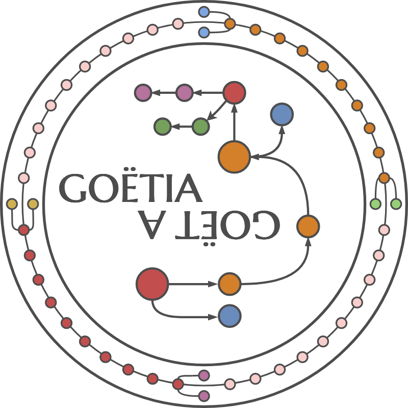

.. image:: https://travis-ci.org/camillescott/goetia.svg?branch=master
    :target: https://travis-ci.org/camillescott/goetia

.. image:: https://mybinder.org/badge_logo.svg
    :target: https://mybinder.org/v2/gh/camillescott/goetia/master?filepath=examples%2FStreaming%20Sourmash%20Demo.ipynb

    
goetia is a c++ library and software package for streaming analysis for de Bruijn Graphs, de Bruijn
graph compaction, and genome sketching. The c++ library is fully available through Python via
bindings generated by `cppyy <https://cppyy.readthedocs.io/en/latest/>`_. The primary goals of
goetia and its algorithms are:
- Analyse data completely on-line with streaming methods,
- Use as little of the data as possible.

Installation
============

Conda
~~~~~

The primary supported platform is through `conda <https://docs.conda.io/en/latest/miniconda.html>`_. Within a conda
environment, install with::

    conda install goetia

This will install the goetia python package, install the `libgoetia` shared library
and its headers into ``$CONDA_PREFIX``.

Building from Source
~~~~~~~~~~~~~~~~~~~~

To build and install from source, first clone the repo::

    git clone https://github.com/camillescott/goetia && cd goetia

Then create a conda environment::

    conda create -y -n goetia -c conda-forge python=3 cppyy cmake cxx-compiler c-compiler clangdev libcxx libstdcxx-ng libgcc-ng pytest numpy scipy openmp python-clang screed blessings pytest-benchmark pyfiglet py-cpuinfo sourmash curio
    conda activate goetia

Then build and install with cmake::

    mkdir build; cd build
    cmake ..
    make # optionally use -j N for faster/parallel build
    make install
